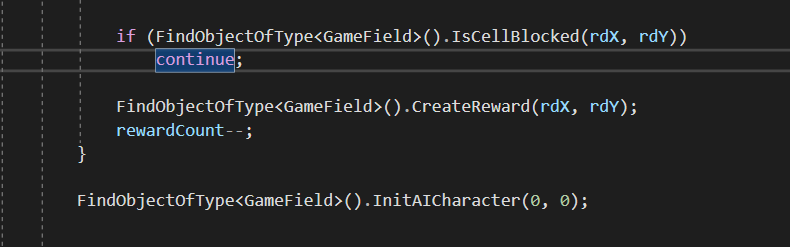
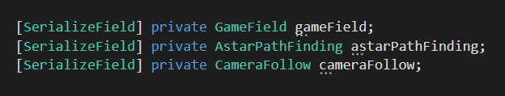
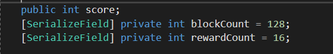
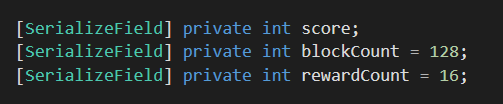
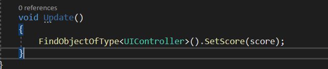
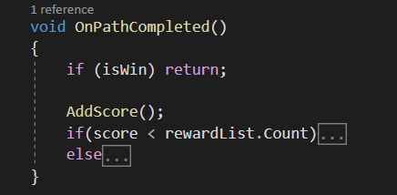

# Avoid using find.

 It is generally better to avoid using the FindObjectOfType method and instead use object references to access specific GameObjects or components in your Unity project. Using object references allows you to access the objects and components directly, which can be more efficient and easier to maintain than using the FindObjectOfType method. For example: 
 
 

# Avoid using public variable

It is generally better to avoid using public variables and instead use private variables with public getter and setter methods in your Unity scripts. Using private variables helps to encapsulate the data in your scripts, which can make your code more modular and easier to maintain.

Use [SerializeField] of private varibale instead if you want to expose the variable into the inspector. So the 'score' variable must be like this:

 

# Be Carefull using Update

 

It is important to be careful when using the Update function in Unity, as it is called every frame and can have a significant impact on the performance of your project. If you want to update UI score text, just call it every time the condition triggered. For example: 

 

